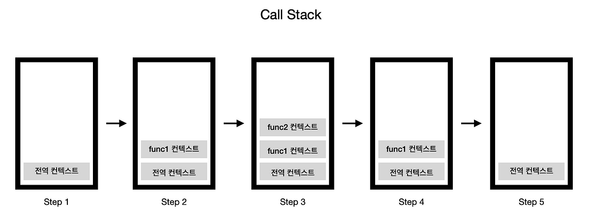

#
## 실행 컨텍스트
#
실행컨텍스트는 JavaScript 엔진이 코드를 실행하기 위해 필요한 환경 정보를 모아놓은 객체이다.
#
코드가 실행될 때 JavaScript 엔진은  해당 코드가 어떤 황경에서 
실행되는지 어떤 변수와 함수를 사용할 수 있는지 등의 정보를 관리한다

#

---

#

## 컨텍스트 종류
#
JavaScript에는 세 가지 유형의 실행 컨텍스트가 있지만, 2가지만 서술한다(eval은 제외)
#
1.  전역 컨텍스트 : 코드가 실행되기 전의 초기 상태를 나타내는 컨텍스트
    - 코드가 처음 실행될 때 생성되는 기본 컨텍스트
    - 전역 객체(브라우저에서는 `window`, Node.js에서는 `global`)를 생성
    - 모든 JavaScript 프로그램은 하나의 전역 실행 컨텍스트를 가짐
2. 함수 컨텍스트 : 함수가 호출될 때 생성되는 컨텍스트
    - 함수가 호출될 때마다 생성
    - 각 함수는 고유한 실행 컨텍스트를 가짐
#
---
#
## 실행 컨텍스트 생성 과정
#
1. 생성 단계
    - Variable Environment, Lexical Environment 생성
    - 외부 환경 참조 설정
    - 변수, 함수 선언문 호이스팅 (Hoisting)
        - 변수 선언은 undefinded로 초기화
        - 함수 선언은 전체 함수 객체가 메모리에 저장
2. 실행 단계
    - 한 줄씩 코드 실행
    - 변수에 실제 값 할당
    - 함수 호출
#
---
#
## 실행 컨텍스트 스택 (Call Stack)
#
JavaScript 엔진은 코드 실행 중에 여러 실행 컨텍스트를 관리하기 위해 '실행 컨텍스트 스택'(또는 콜 스택)이라는 자료구조를 사용한다
#
- 프로그램이 시작되면 전역 실행 컨텍스트가 스택에 푸시됨
- 함수 호출 시 해당 함수의 실행 컨텍스트가 스택 최상단에 푸시됨
- 함수 실행이 완료되면 해당 컨텍스트는 스택에서 팝(제거)됨
- 프로그램이 종료되면 전역 실행 컨텍스트도 스택에서 제거됨
#
---
#
## 렉시컬 환경(Lexical Environment)의 구조
#
렉시컬 환경은 두 부분으로 구성된다
#
- 환경 레코드(Environment Record) : 변수와 함수의 정보를 저장
- 외부 환경 참조(Outer Environment Reference) : 상위 스코프의 렉시컬 환경에 대한 참조
#
---
#
## 스코프 체인 (Scope Chain)
#
스코프 체인은 현재 실행 컨텍스트의 렉시컬 환경과 해당 환경의 외부 환경 참조를 연결한 것
#
- 변수 참조 시 현재 환경에서 먼저 찾고, 없으면 외부 환경을 따라 올라가며 탐색
- 이 과정을 통해 내부 함수에서 외부 함수나 전역 변수에 접근 가능
- 스코프 체인은 코드가 작성된 위치(렉시컬 위치)에 의해 결정됨(렉시컬 스코핑)

#
---
#
## 클로저(Closure)와 실행 컨텍스트
#
클로저는 실행 컨텍스트와 밀접한 관련이 있습니다:
#
- 함수가 생성될 때 해당 함수의 렉시컬 환경이 캡처됨
- 함수가 자신이 선언된 렉시컬 환경 밖에서 실행되더라도 원래 환경에 접근 가능
- 이는 함수의 실행 컨텍스트가 외부 렉시컬 환경에 대한 참조를 유지하기 때문
#
---
#
## 예제로 이해하기
#
```js
var x = 10;  // 전역 변수

function foo() {
  var y = 20;  // foo의 지역 변수
  
  function bar() {
    var z = 30;  // bar의 지역 변수
    console.log(x + y + z);  // 60
  }
  
  bar();
}

foo();
```
#
위 코드의 실행 컨텍스트 동작 과정:

1. 전역 실행 컨텍스트 생성 및 스택에 푸시

    - 변수 x와 함수 foo 선언
    - x에 10 할당


2. foo() 호출 시 foo 실행 컨텍스트 생성 및 스택에 푸시

    - 변수 y와 함수 bar 선언
    - y에 20 할당


3. bar() 호출 시 bar 실행 컨텍스트 생성 및 스택에 푸시

    - 변수 z 선언
    - z에 30 할당
    - x + y + z 계산 시 스코프 체인을 따라 각 변수 값을 찾음
    - 결과 출력 (60)


4. bar() 실행 완료, bar 실행 컨텍스트 스택에서 팝
5. foo() 실행 완료, foo 실행 컨텍스트 스택에서 팝
6. 전역 코드 실행 완료, 전역 실행 컨텍스트 스택에서 팝

