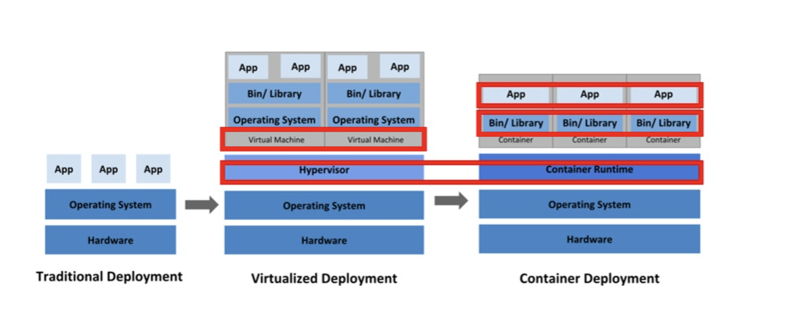

#
# 쿠버네티스와 도커: 현대 개발자의 필수 지식

개발자라면 적어도 Kubernetes와 Docker에 대해서 알아야 합니다.
저는 이 기술들에 대해 충분히 이해하지 못하고 있어 지금부터 체계적으로 정리해보겠습니다.
#
---
#
# 컨테이너의 개념과 중요성
#
컨테이너는 애플리케이션을 실행할 수 있는 환경까지 감싸서, 어디서든 쉽게 실행할 수 있도록 해 주는 기술입니다. 만약 컨테이너 없이 배포를 한다면, 배포 서버와 개발 서버의 환경을 일일이 맞춰야 합니다. 이는 시간과 자원의 낭비를 초래할 수 있습니다.
#
이러한 컨테이너를 효율적으로 사용하기 위해서는 컨테이너 런타임이라는 도구가 필요합니다.

#
## 컨테이너 런타임의 역할
#
컨테이너 런타임은 컨테이너를 쉽게 내려받거나 공유하고 구동할 수 있도록 해주는 도구입니다.
이 중 가장 널리 알려지고 사용되는 것이 도커(Docker)입니다. 도커는 직관적인 인터페이스와 풍부한 생태계를 갖추고 있어 많은 개발자들이 선호합니다.
#
## 쿠버네티스의 정의와 기능
#
쿠버네티스는 컨테이너 런타임을 통해 컨테이너를 효과적으로 관리하는 도구입니다. 쿠버네티스가 제공하는 주요 기능은 다음과 같습니다:

1. 여러 서버에 컨테이너를 분산 배치
2. 문제가 발생한 컨테이너의 자동 교체
3. 컨테이너가 사용할 비밀번호나 환경 설정의 관리 및 주입

이러한 일련의 관리 작업을 '컨테이너 오케스트레이션'이라고 합니다. 쿠버네티스는 현재 가장 널리 사용되는 컨테이너 오케스트레이션 도구입니다.

#
## 쿠버네티스와 도커의 관계
#

쿠버네티스의 역할은 컨테이너를 분산 배치하고, 상태를 관리하며, 컨테이너의 구동 환경까지 관리해 주는 것입니다. 반면 도커는 컨테이너를 다루는 도구(컨테이너 런타임) 중 하나입니다.

주목할 점은 쿠버네티스가 도커에만 의존하지 않는다는 것입니다. 쿠버네티스는 컨테이너를 다루기 위해 도커 이외에도 containerd, CRI-O 등 다양한 컨테이너 런타임 소프트웨어를 사용할 수 있습니다. 이러한 유연성은 쿠버네티스의 큰 장점 중 하나입니다.

#

---

#
## 배포 방식의 진화: 전통적 배포에서 컨테이너까지
#

### 전통적 배포 방식
#

#
맨 왼쪽의 Traditional Deployment(전통적 배포)는 가상화 이전부터 사용되던 방식입니다. 물리적인 컴퓨터 한 대에 하나의 운영체제를 설치하고, 그 위에 여러 가지 프로그램을 설치하는 방식입니다. 이는 가장 오래되고 단순한 방식으로, 단일 목적의 시스템이라면 충분히 효과적일 수 있습니다.

#
### 전통적 배포의 한계점
#

그러나 한 대의 컴퓨터에서 모든 것을 처리하려고 할 때 중요한 문제가 발생합니다. 특정 프로그램이 시스템 자원을 과도하게 사용하면 다른 프로그램의 성능이 현저히 저하될 수 있습니다. 이는 안정적인 서비스 제공에 큰 장애가 됩니다.

이러한 문제를 해결하기 위한 가장 단순한 방법은 무엇일까요? "각 용도별로 별도의 컴퓨터를 사용하면 되지 않을까?"라고 생각할 수 있습니다. 예를 들어, 인터넷 뱅킹 전용 컴퓨터와 게임 전용 컴퓨터를 따로 구비하는 방식입니다. 그러나 이 접근법은 비용 측면에서 매우 비효율적입니다.

그렇다면 보다 효율적인 해결책은 무엇일까요? 이제 가상화 기술에 대해 살펴보겠습니다.

#
---
#
### 가상화 배포 방식
#

#
전통적 배포의 한계를 극복하기 위해 등장한 것이 Virtualized Deployment(가상화 배포)입니다. 

이 방식은 가상머신(Virtual Machine)을 기반으로 합니다. 하이퍼바이저(Hypervisor)라는 중간 계층이 하나의 물리적 시스템 상에서 여러 개의 가상 컴퓨터를 구동할 수 있게 해줍니다. 각 가상머신은 독립적인 컴퓨터처럼 작동하며, 자체 운영체제를 가지고 있습니다.

가상머신은 실제 컴퓨터와 마찬가지로 CPU, 메모리, 저장 장치 등의 자원을 개별적으로 할당받을 수 있습니다. 이를 통해 한 물리적 서버에서 여러 개의 독립된 환경을 운영할 수 있게 됩니다.

그러나 가상화 방식에도 한계가 있습니다. 가상머신은 완전한 컴퓨터로 작동하기 때문에 각각에 운영체제를 설치해야 하며, 이는 상당한 시스템 자원을 소모합니다. 따라서 컨테이너 중심의 배포(Container Deployment)에 비해 상대적으로 무겁고 비효율적일 수 있습니다.

