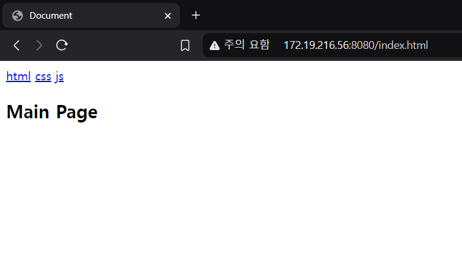

#


#
## 저번에 만든 서버의 문제점
#
http 서버인데 브라우저에서 접속을 할 수 없었다. 

헤더를 전송하는 코드가 없어서 접속이 안됐다. 

이번에는 브라우저에서 접속할 수 있도록 헤더를 추가하고,

다양한 파일을 접속 할 수 있게 하기 위해서 

receive 문자열을 동적으로 처리해서 다양한 페이지를

볼 수 있도록 만들 것이다
#
## 코드
#
```
#include <sys/socket.h>    // 소켓 프로그래밍에 필요한 기본 헤더
#include <string.h>        // 문자열 처리 함수를 위한 헤더
#include <stdio.h>         // 표준 입출력 함수를 위한 헤더
#include <fcntl.h>         // 파일 제어를 위한 헤더
#include <sys/sendfile.h>  // sendfile() 함수를 위한 헤더
#include <unistd.h>        // UNIX 표준 함수를 위한 헤더
#include <netinet/in.h>    // 인터넷 프로토콜 함수를 위한 헤더
#include <time.h>          // 시간 관련 함수를 위한 헤더
#include <sys/stat.h>      // 파일 상태 정보를 위한 헤더

int main() {
    int server_fd = socket(AF_INET, SOCK_STREAM, 0);    // TCP 소켓 생성
    
    int opt = 1;    // 소켓 옵션 값 설정
    setsockopt(server_fd, SOL_SOCKET, SO_REUSEADDR, &opt, sizeof(opt));    // 소켓 주소 재사용 옵션 설정
    
    struct sockaddr_in addr = {    // 서버 주소 구조체 초기화
        .sin_family = AF_INET,     // IPv4 주소 체계 사용
        .sin_port = htons(8080),   // 포트 8080 설정 (호스트 바이트 순서를 네트워크 바이트 순서로 변환)
        .sin_addr.s_addr = INADDR_ANY    // 모든 네트워크 인터페이스에서 연결 수락
    };
    
    if (bind(server_fd, (struct sockaddr *)&addr, sizeof(addr)) < 0) {    // 소켓에 주소 바인딩
        perror("bind failed");    // 바인딩 실패시 에러 메시지 출력
        return 1;    // 프로그램 종료
    }
    
    if (listen(server_fd, 10) < 0) {    // 연결 대기열 10개로 설정하여 리스닝 시작
        perror("listen failed");    // 리스닝 실패시 에러 메시지 출력
        return 1;    // 프로그램 종료
    }
    
    printf("Server listening on port 8080...\n");    // 서버 시작 메시지 출력
    
    while (1) {    // 무한 루프로 클라이언트 요청 계속 처리
        int client_fd = accept(server_fd, NULL, NULL);    // 클라이언트 연결 수락
        if (client_fd < 0) {    // 연결 수락 실패 체크
            perror("accept failed");    // 실패시 에러 메시지 출력
            continue;    // 다음 연결 시도
        }
        
        char buffer[4096] = {0};    // 요청을 저장할 버퍼 초기화
        ssize_t bytes_read = recv(client_fd, buffer, sizeof(buffer) - 1, 0);    // 클라이언트로부터 데이터 수신
        
        if (bytes_read <= 0) {    // 데이터 수신 실패 체크
            close(client_fd);    // 클라이언트 소켓 닫기
            continue;    // 다음 연결 처리
        }
        
        char file_path[256] = {0};    // 파일 경로를 저장할 버퍼 초기화
        if (sscanf(buffer, "GET /%255s", file_path) != 1) {    // HTTP GET 요청에서 파일 경로 추출
            char *response = "HTTP/1.1 400 Bad Request\r\nContent-Type: text/plain\r\n\r\nInvalid Request";    // 잘못된 요청 응답 메시지
            send(client_fd, response, strlen(response), 0);    // 에러 응답 전송
            close(client_fd);    // 클라이언트 소켓 닫기
            continue;    // 다음 연결 처리
        }
        
        char *space_pos = strchr(file_path, ' ');    // 파일 경로에서 공백 문자 찾기
        if (space_pos) *space_pos = '\0';    // 공백 문자를 NULL로 변경하여 문자열 종료
        
        printf("Requesting file: %s\n", file_path);    // 요청된 파일 경로 출력
        
        int file_fd = open(file_path, O_RDONLY);    // 요청된 파일 열기
        if (file_fd < 0) {    // 파일 열기 실패 체크
            printf("Failed to open file: %s\n", file_path);    // 실패 메시지 출력
            char *response = "HTTP/1.1 404 Not Found\r\nContent-Type: text/plain\r\n\r\n404 File Not Found";    // 404 에러 응답
            send(client_fd, response, strlen(response), 0);    // 에러 응답 전송
        } else {
            struct stat file_stat;    // 파일 정보를 저장할 구조체
            if (fstat(file_fd, &file_stat) < 0) {    // 파일 정보 가져오기
                close(file_fd);    // 파일 디스크립터 닫기
                close(client_fd);    // 클라이언트 소켓 닫기
                continue;    // 다음 연결 처리
            }
            
            char header[512];    // HTTP 헤더를 저장할 버퍼
            sprintf(header, "HTTP/1.1 200 OK\r\nContent-Type: text/html\r\nContent-Length: %ld\r\n\r\n", file_stat.st_size);    // HTTP 성공 응답 헤더 생성
            send(client_fd, header, strlen(header), 0);    // HTTP 헤더 전송
            
            off_t offset = 0;    // 파일 오프셋
            ssize_t sent = sendfile(client_fd, file_fd, &offset, file_stat.st_size);    // 파일 데이터 전송
            if (sent < 0) {    // 파일 전송 실패 체크
                perror("sendfile failed");    // 실패시 에러 메시지 출력
            }
            
            close(file_fd);    // 파일 디스크립터 닫기
        }
        
        close(client_fd);    // 클라이언트 소켓 닫기
    }
    
    close(server_fd);    // 서버 소켓 닫기
    return 0;    // 프로그램 종료
}
```
#
이렇게 코드를 구성하였다. 
#
무슨 기능을 추가했을까?
#
1. 헤더 삽입

2. 동적인 receive 처리

3. 예외 처리

4. 무한 루프 추가
#
이렇게 하니까 웹서버를 구축할 수 있었다. 
#
GPT가 아직까지는 내 코드를 이해해서 어렵지 않게 만들 수 있었다
#
다음은 서버 배포를 해서 다른 컴퓨터에서도 이 서버를 접속 할 수 있도록 만들어 볼 것이다.
#
## 문제점
#
명색이 웹서버인데 내부에서만 작동해서 친구들에게 공유해줄 수 없다.
#
그래서 외부에서도 나의 서버를 방문할 수 있도록 포트 방화벽 설정을 해보자
#
## 설정
#
방화벽 설정을 확인하고 포트 8080을 허용해보자
#
`sudo iptables -A INPUT -p tcp --dport 8080 -j ACCEPT`
#
`sudo ufw allow 8080/tcp`

#
접속해보자
#

#
굳굳 잘들어가진다
#
## 또다른 문제점
#
지금 이 서버를 학교 WIFI로 구동하고 있는데, 학교 와이파이에서는 포트포워딩이 되지 않는다!!
#
그래서 매번 애들한테 다른 주소를 전송해야한다 ㅜㅠ