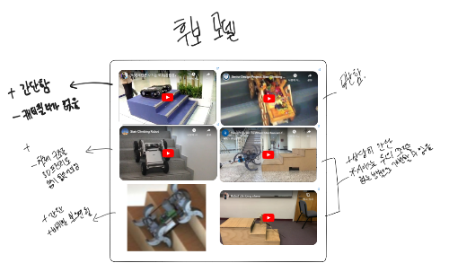
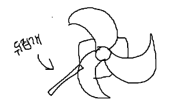
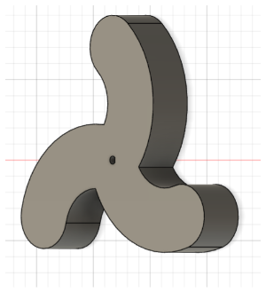
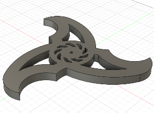

#
> 2024 로봇경진대회 - 미션투마스를 준비하는 과정에서 느꼈던 것을 정리하고, 추후 이 대회에 참가 분들에 도움이 되기를 바라며 글을 작성하였다. 🖊️
#
## 참가 계기
#
2024년 8월 [동욱](https://github.com/dongwookkim3 "동욱")이가 "로봇경진대회 - 미션투마스"에 대해서 알려줬다

4주 후에 벡스코에서 여는 규모있는 대회였는데, 자세히 알아보니

총 참가자가 8명이고, 작년 대회 수상자가 총 8명이였다

무조건 수상 할 수 있다 생각으로 대회에 참가했다
#
---
#
## 1일차
#
대회 규칙에 대해 자세히 살펴보자
#
_**1\. 차체 사이즈는 25cm x _**25cm x**_  _**25cm 이하여야 한다**_**_

_**2\. 10cm 높이의 계단 2개를 넘어 상대 진영으로 넘어가야 한다**_
#
우리는 로봇 팔과 같은 바퀴 이외의 요소로 계단을 오르지 않을 것이기 때문에

계단을 수월하게 올라갈 수 있도록 바퀴 사이즈를 24cm으로 정했다

바퀴 형태는 이를 기준으로 정하였다
#
1. 간단한 형태인가

2. 3D 프린터로 뽑을 수 있는가
#

#
이에 모두 부합하는 삼각별 형태 바퀴로 정하였다

_**4.  상대 진영의 30mm x 6mm 짜리 원판을 뒤집어 점수를 획득한다**_
#

#
처음에 저희는 차체에 모터를 하나 더 달아서 

뒤집개로 원판을 뒤집을 수 있다 생각했다

하지만 바퀴의 모양이 삼각형이라

움직일 때 차체 높이가 계속 달라져서

뒤집개를 정확히 바닥에 맞추는 것이

어려울 것이라 판단하였다

그래서 저희는 차체에 따로 모터를 달지 않고

바퀴에 양면테이프를 붙여 원판을 뒤집는 방식으로 정하였다
#
---
#
## 2~3일차
#
바퀴의 모델링을 진행했다

이 설계가 무게 부하를 분산하고

계단을 올라갈 때 지면을 잘 잡아줄 수 있을 것이라 생각해

이런 디자인을 선택했다
#

#
바퀴 디자인을 완료하고 3D 프린터에 출력을 시켰다

또한 MCU, 모터와 모터 드라이버를 정했다.

MCU는 빨리 만들 수 있는 아두이노를 사용했다

모터는 계단을 오를 정도로 강한 토크가 필요하기 때문에 [스테핑 모터](https://www.devicemart.co.kr/goods/view?no=1084466)를 사용했다

모터 드라이버는 스테핑 모터에 맞는 [A4899](https://www.devicemart.co.kr/goods/view?no=10912921)를 사용했다
#
---
#
## 4일차
#
바퀴가 출력된 걸 보니 두께가 너무 두껍고, 계단을 오르기에 끝 부분이 너무 뭉툭하다는 생각이 들었다.

또한 프린팅 해야하는 면적이 너무 넒어 프린팅 시간이 오래걸린다는 단점이 있었다

이런 단점을 보완한 V2 디자인을 완성했다
#

#
---
#
## 5일차
#
대회 규칙 중 
#
_**1\. 통신 방식은 무선으로 한다**_
#
라는 규칙이 있다

여러 무선 통신 방법(적외선, 블루투스, Wifi) 중 적외선을 사용하였다

대회 2일전 밤 9시쯤, 동욱이한테 모터 토크가 부족해서 바퀴가 돌아가지 않는다는 얘기를 들었다

평지에서도 돌아가지 않아서 계단을 올라갈 수 있을 리가 없었고 저희는 지레짐작으로 실격을 생각하고 있었다..
#
---
#
## 대회 당일
#
대회 당일까지 저는 적외선 통신으로 로봇을 구동시키지 못해서 참가하기가 싫었다

그래도 일요일에 벡스코까지 갔으니까 자료수집이라도 할겸 대회 장소로 이동했다

진행자분께 로봇 미완성을 미리 말씀드리고 저희는 대회에서 실격 하게 됬다.(미완성이라 참가할 수 없음)

다른 참가자는 어떤 형태로 로봇을 만들었을지 궁금해서 주변을 둘러봤는데

우리 둘을 제외한 나머지 5명(한명 불참)이 전부 똑같은 형태의 로봇을 가지고 있었다. 

로보티즈를 써서 만든 것 같던데 형태까지 완전 똑같은 것이 아마 학원에서 만들어 주지 않았을까 라는 생각이 들었다
#
---
#
## 대회가 끝나고
#
아쉽다!