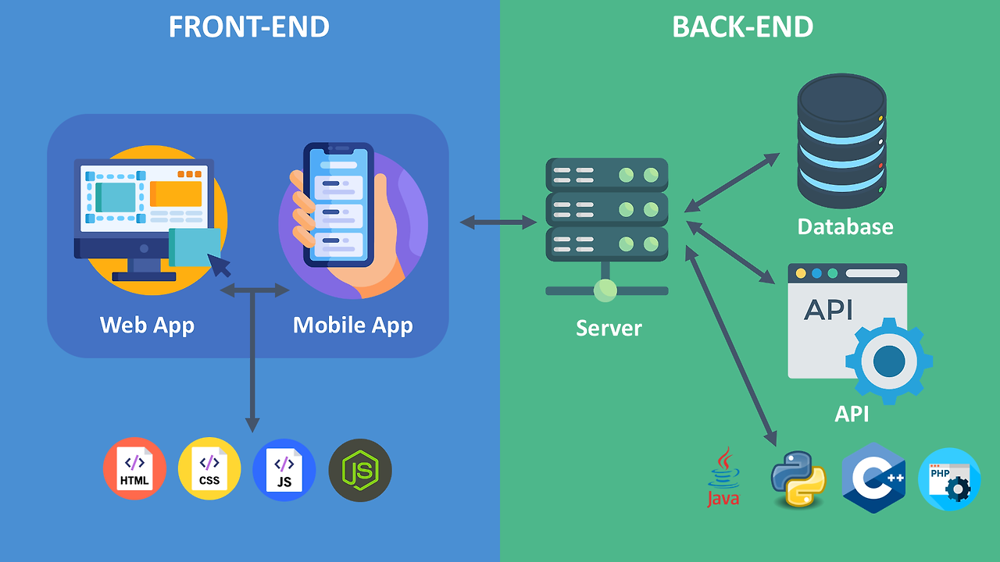
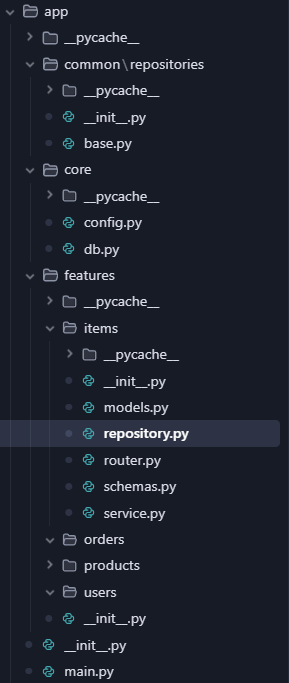

#
## 아니 FastAPI로 다 짜면 되는거 아니야??
#

나는 항상 "모든 것을 FastAPI로 짜면 되는거 아니야??" 라는 생각을 했다
ORM도 FastAPI로 되고 MVC도 되고 다 되고 PYTHON이라 더 쉬운데..
그래서 FastAPI로 복잡한 애플리케이션을 설계해보았다

#
## 설계
#

#

하..

이 구조를 만드는데까지 많은 문제가 있었다

1. nestjs처럼 자동으로 MVC를 만들어주지 않아서 스스로 설계해야한다
2. 파이썬은 ORM을 지원하지 않아서 SQLAlchemy를 사용했다
3. 이렇게 복잡하게 짤거면 파이썬을 안쓰고 JAVA를 쓸 것 같다

다양한 프레임워크를 사용하는 이유를 알았다!!!!

파이썬은 파일이 하나일 때 가장 예쁜 것 같다

#
## 결론
#

사실 채용공고에 파이썬이 많아서 전부 파이썬으로 설계하려고 했다

하지만 파이썬의 한계?(타입을 지정하지 않음, 객체지향적 설계 한계)를 알게 되었다

이제 스프링부트를 공부해보자