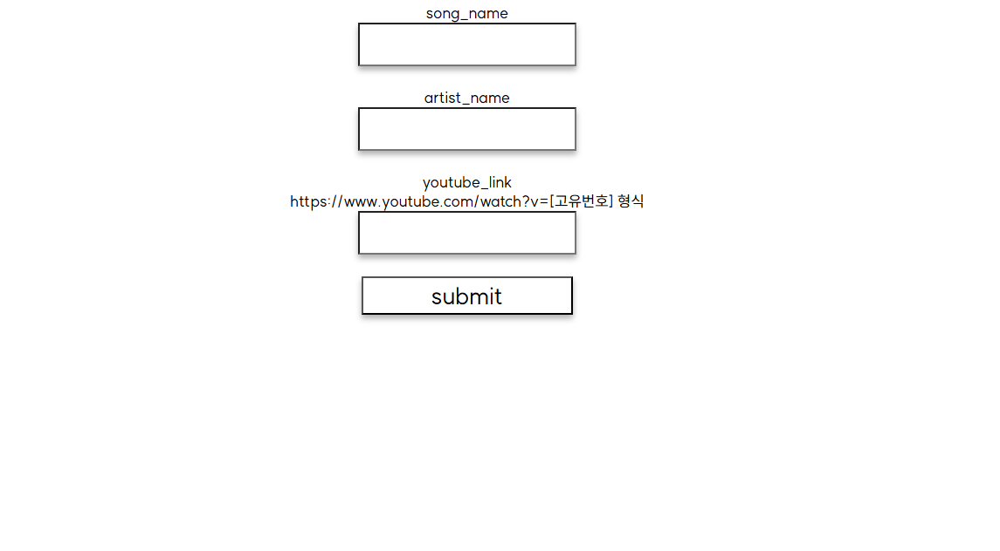

#
<div style="display: flex; justify-content: space-between; margin-bottom: 20px;">
  
  
  
</div>

#
**[RouseSong](https://github.com/wbhaao/RouseSong_project) (2023)**
#

### 계기
#
저희 학교는 모든 학생이 기숙사 생활을 하게 됩니다. 그리고 매일 아침에 기상송이 나오는데, 심할 때는 3달동안 똑같은 기상송을 들을 때도 있었습니다. 노이로제에서 벗어나고자 학생에게 기상송을 추천받고 매주 기상송을 바꾸자는 아이디어로 사이트를 만들게 되었습니다
#
---
#
### 문제해결?
#
당시에는 

1. React를 사용할 줄 모르고
2. Pug, Jinja의 존재를 몰랐기 때문에

#
```js
music_arr[Object.keys(data.song_list).length - i + 1] = `
      <div id="music-box">
        <a target="_blank" href="${data.song_list[i].youtube_link}">
          
        </a>
        <div id="artist-info">
          <div id="song-name">${data.song_list[i].song_name}</div>
          <div id="artist-name">${data.song_list[i].artist_name}</div>
          <div id="author-info">글쓴이 : ${data.song_list[i].author}</div>
```
#
이렇게 express.js 안에 html을 넣어서 동적으로 구현했습니다. 
#
지금은 서비스하지 않는 BSSM Portfolio에도 매우 많은(?) 좋아요를 받으면서 인기를 끌었습니다
#
(web) express.js / json(db대용) / html,css
#
(팀원) 개인 작품
#