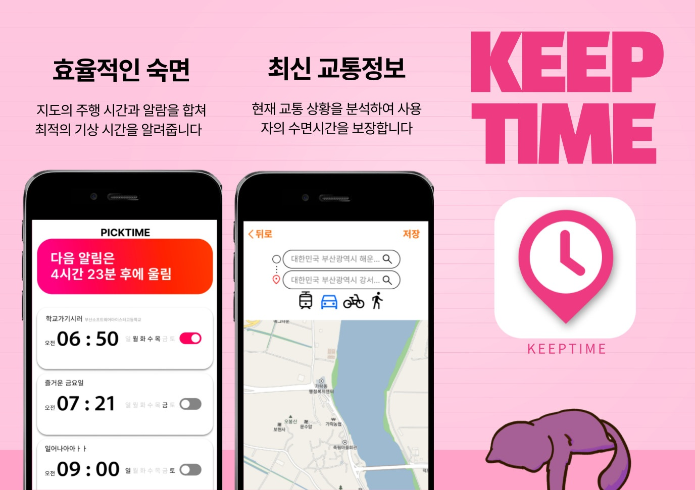

#

#
**[Keeptime](https://github.com/orgs/RNtimer/repositories) (2023)**
#
### 계기
#
저는 부산 강서구에 살고 있는데, 이곳 버스는 대부분 배차 간격이 한 시간이라 약속 시간에 맞춰 나가기가 늘 불편합니다. 그래서 약속 시간보다 한 시간 먼저 일어나 버스가 있으면 뛰쳐나가고, 없으면 다음 차를 기다리며 50분 동안 시간을 보내곤 했습니다. 이러한 불편을 해소하기 위해 교통 상황과 버스 배차 간격을 고려해 최적의 기상 시간을 알려주는 알람 앱이 있으면 좋겠다고 생각했고, 그 아이디어로 이번 프로젝트를 시작하게 되었습니다.

#
### 아쉬운 점 : Jotai의 존재를 알지 못했던 문제
#
당시 저희는 리액트도 제대로 모르는 상태에서 해커톤 하루 전 __5배속으로__ 노마드코더 RN 강의를 듣고 개발을 시작했습니다. 물론 useState, useEffect 등의 Hook은 익숙했지만, 전역 변수를 어떻게 관리하는지 몰라 모든 데이터를 Props로 타고타고 넘겨주는 문제가 있었습니다.
이렇게 하다보니, 코드가 매우 복잡해지게 되면서 시연날까지 기능을 제대로 구현하지 못하였습니다. (근데 또 시연 막바지에 문제점 찾아서 고침) 

#
### 좋은 점 : 끈기
#

교통 상황과 배차 간격을 고려하는 기능을 구현하기 위해 KakaoMap API를 도입했으나, 사용할 때마다 에러가 발생해 당시 ChatGPT 버전으로는 해결이 쉽지 않았습니다. 해커톤 시작 후 6시간이 지나도 진전이 없자 저는 “지금이라도 다른 아이디어를 시도해보자”고 팀원들에게 제안했지만, 영현이가 모든 오류를 해결하고 기능을 완성해 주어 결국 이 아이디어로 앱 개발을 이어갈 수 있었습니다.
#
또한, 저는 페이지 간 데이터 전달을 위해 Props를 적극 활용해 대부분의 페이지에서 동일한 데이터를 손쉽게 공유할 수 있도록 구현했습니다.

#
### 결과
#

대회의 주제가 IOT였지만 저희는 실체없이 앱으로만 개발하여 여러 지적을 받았습니다. 하지만 1학년이 프레임워크를 사용해서 실제 동작가능한 앱을 만든 것을 좋게 봐주시면서 최종적으로 최우수상을 수상하게 되었습니다

#
(app) React Native
#
(팀원) 김규민(React Native), 강도현(React Native), 김민재(디자인), 전영현(React Native), 정수환(디자인)
#