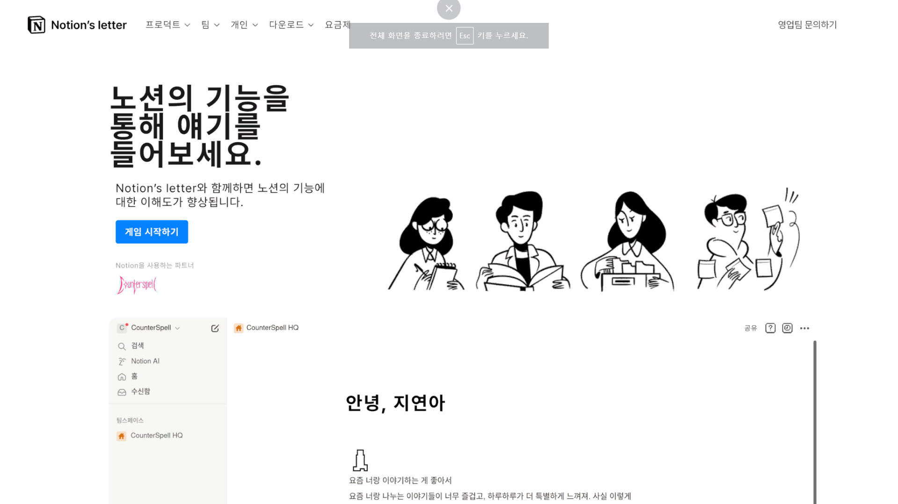
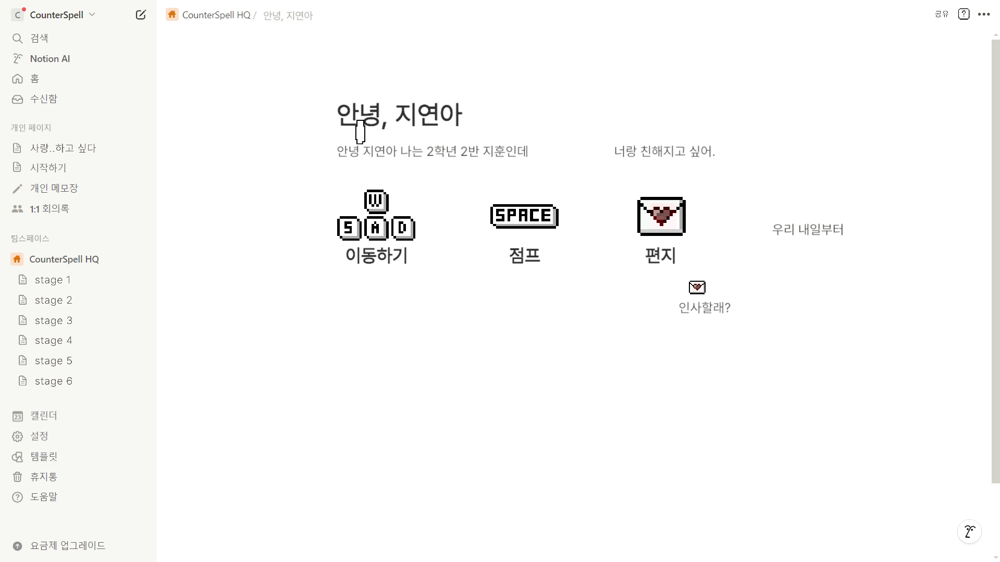
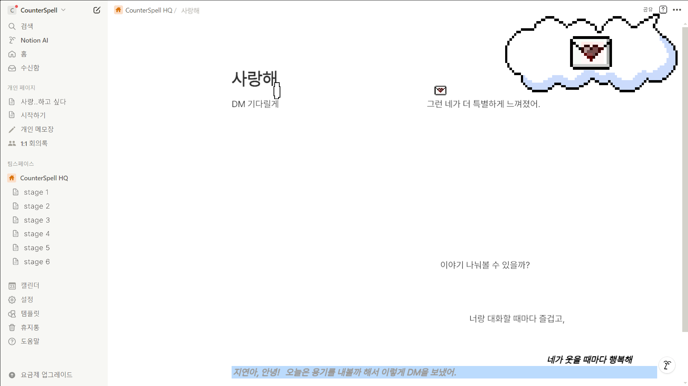

#

#

#

#
**[NotionLetter](https://github.com/gyumingim/counterspell) (2024)**
#
### 계기
#

노션은 페이지 작성부터 데이터베이스 관리까지 다양한 기능을 제공했지만, 방대한 단축키 때문에 처음 접하는 사용자들은 익히기 어려웠습니다.
반복 학습이 필요하지만 지루함이 큰 장벽이었기에, 게임 요소를 도입해 퀴즈형 레벨로 단축키를 재미있게 익힐 수 있도록 기획했습니다.

#
### 트러블슈팅
#

1. 폰트 깨짐 현상
    - 기본 폰트를 사용하면 글자가 의도치 않게 깨져 보였기 때문에, 웹 환경에 최적화된 새로운 폰트(예: Google Fonts의 Noto Sans 등)로 교체해 문제를 해결했습니다.

#

2. 화면 비율에 따른 충돌 영역 불일치
    - 브라우저 창 크기나 기기별 화면 비율이 달라질 때마다 Collider 위치가 달라져 의도치 않게 충돌 판정이 어긋났습니다.
    - 이를 해결하기 위해 게임을 강제로 풀스크린 모드로 고정해, 언제나 동일한 해상도와 화면 비율로 동작하도록 설정했습니다.

#

(game) Unity
#
(design) Aseprite
#
(팀원) 김규민(Aseprite), 김동욱(기획), 변정현(Unity), 이지우(발표), 조윤서(기획)
#
##
#