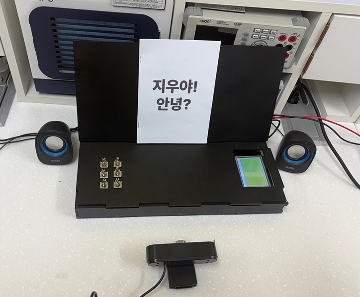
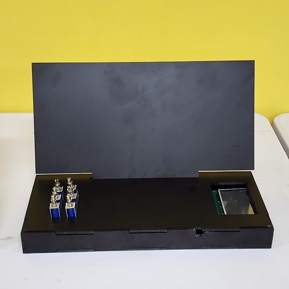
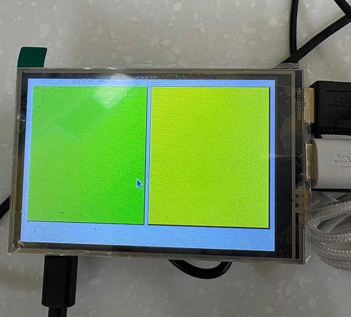
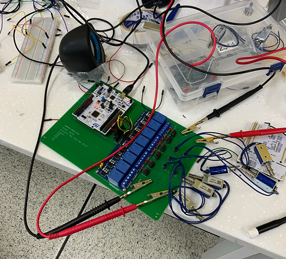

|  |  |  |
|:---|:---|:---|

|  |  |  |
|:---|:---|:---|

#
**[WESEE (github)](https://github.com/gyumingim/WESEE_BE)**
#
## 시각장애인을 위한 스마트 독서대, WESEE
#
글자 책을 OCR을 통해 점자, 음성으로 변환해주는 독서대입니다
 
교내 임베디드 경진대회에서 대상(1위)을 받았습니다

#
(팀원) 김규민(서버), 박강은(하드웨어), 박현겸(윈폼), 이승주(라눅스), 이지우(3D, 하드웨어)
#
### 계기
#
시각장애인은 책이나 문서를 읽는 데 있어 많은 제약을 겪고 있습니다. 점자책은 종류가 제한적이고, 화면 읽기 프로그램도 사용하고 바로 점자나 음성으로 나오는 것이 아니기 때문에, 2차 가공이 필요합니다.
이에 대해 시각장애인 분들이 더 다양한 정보를 자유롭게 접할 수 있도록 돕는 방법에 대해 고민하게 되었습니다.
시각장애인분들이 손쉽게 사용할 수 있는 독서대 형태의 기기를 구상하게 되었고, 이로 인해 이 프로젝트가 기획하게 되었습니다
#
### 기술스택
#

#
### API 구조
#

#
### 기여한 부분
#

1. Winform에서 Raspberry Pi Camera를 동작 시킬 때 오류가 있어, 카메라 캡쳐 로직을 백엔드에 추가했습니다
2. 이미지 값을 Base64로 변환해서 DB없이 이미지 정보를 주고받을 수 있게 만들었습니다 
3. 불러온 이미지를 OCR 처리해서 글을 추출하고, TTS와 점자 데이터로 변환했습니다. 
4. 6개의 솔레노이드 액추에이터에 전원을 공급하기 위해 릴레이모듈, SMPS를 사용했습니다

#
### 문제해결
#

1. **점자 배열 → 십진수 변환 문제**
    - 문제: 한글 글자를 점자 6칸 배열로 잘 매핑했지만, 배열을 이진 문자열("101001")로 바꾼 뒤 parseInt(..., 2)로 십진수 변환할 때 값이 자꾸 어긋났습니다.
    - 원인: STM32 코드 내부에서 숫자 앞의 0을 생략했습니다
    - 해결방안 : 하드웨어 팀원과 여러 해결책을 제시했습니다. 
        1. 하드웨어에서 점자 데이터를 Int가 아닌 String으로 받고, 형변환 하는 방법 
        2. Wifi가 가능한 MCU로 바꾼 다음, UART가 아닌 MQTT로 값을 주고 받는 방법 (UART 방식보다 값이 어긋나는 이유를 쉽게 찾아 고칠 수 있습니다)
    - 최종 해결: 이진수를 십진수로 변환하여, 0이 생략되지 않도록 만들었습니다
2. **OCR 라이브러리 교체 및 서버 분리**
    - 문제: EasyOCR 기반으로 이미지를 읽어 점자 변환을 시도했지만, 한글 문장 인식률이 낮고 간헐적으로 엉뚱하게 읽히는 오류가 있었습니다.
    - 결정: 다양한 파라미터 튜닝과 전처리(그레이스케일, 노이즈 제거 등)에도 인식 품질이 개선되지 않아, OCR 라이브러리 자체를 교체하기로 결정했습니다.
    - 해결방식:
        - 라이브러리 교체: EasyOCR → PaddleOCR 전환, 한글 전용 OCR 모델로 바꾸자 정확도가 크게 올라감
        - 환경 호환성: PaddleOCR가 리눅스 컨테이너에서 동작하지 않아 앱 빌드가 실패 → OCR 전용 서버를 별도 구축해 REST API로 분리
    - 해결: OCR 성능이 안정화되고, 브라우저∙앱 양쪽에서 모두 문제 없이 점자 변환 워크플로우가 작동하게 되었습니다.
#
