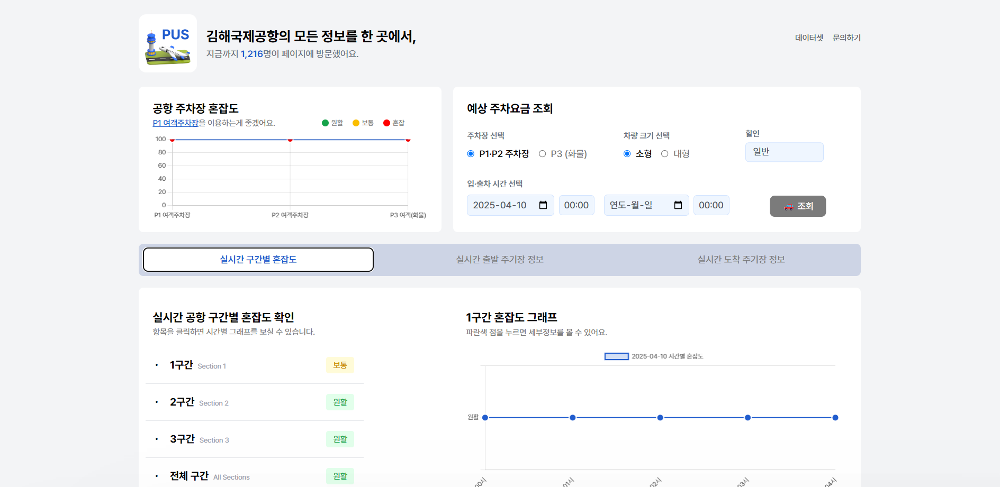
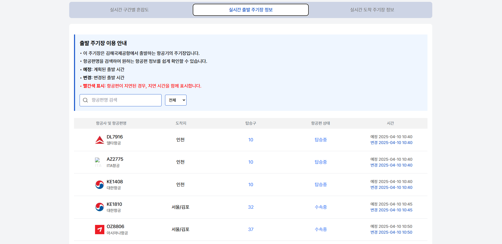
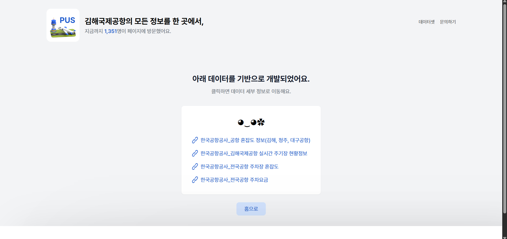
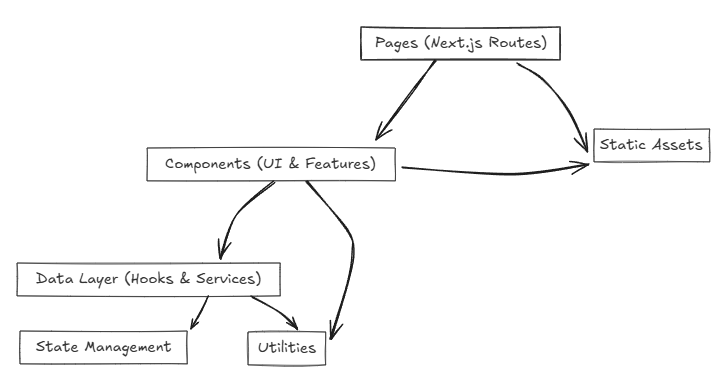

|  |  |
|:---|:---|

|  |  |
|:---|:---|

#
**[AIRPORT-PUS (github)](https://github.com/airport-pus/Client)**
#
## 김해국제공항 실시간 모니터링 웹사이트, Airport-PUS
#
김해국제공항 이용자를 위해 주기장 이/착륙 정보, 주차장 요금, 혼잡도를 알려주는 웹사이트입니다
 

2개월 동안 **500+명**의 사용자가 사이트를 **1,600+회** 방문했었습니다.

#
(팀원) 김규민(프론트엔드), 신희성(프론트엔드), 김승빈(서버)
#
### 계기
#
고등학교 2학년 겨울방학,
방학 동안 꼭 사용자가 실제로 유입할 수 있는 웹사이트를 만들어보고 싶었습니다. 
그렇게 아이디어를 찾고, 여러 공공데이터를 찾아보던 중, 우연히 서희찬 님이 개발한 ‘인천국제공항 승객 현황’ 웹사이트를 보게 됐다. 데이터를 잘 정리해서 시각적으로 보여주는 구조가 인상 깊었고, 무엇보다 상단에 사용한 공공데이터 링크를 걸어두신 것을 보고 나도 ‘공공데이터를 활용해서 무언가 만들어보자’는 아이디어를 갖게 되어, 김해국제공항의 정보를 한눈에 볼 수 있는 사이트, Airport-PUS를 기획하게 되었습니다
#
### 기술스택
#

#
### 프론트엔드 아키텍쳐
#

#
### 기여한 부분
#

1. 예상 주차요금 조회, 주기장 정보 부분을 퍼블리싱했습니다
2. 주기장 정보, 방문자 수 데이터 API를 연동하고 useSWR을 사용해 최적화했습니다
3. Jotai를 도입하여 클라이언트 데이터를 관리했습니다 
4. tailwind를 활용하여 반응형 스타일을 구축했습니다

#
### 문제해결
#
1. 배포에 대한 문제
    - 문제 : Vercel은 GitHub 조직 무료 배포 한도 초과, Netlify는 해외 서버로 렌더링 속도가 20초 이상으로 매우 느려 배포 방식으로 부적절했습니다
    - 해결 방법 : render.com을 알게되어 사용했습니다
    - 2차 문제 : 완전 무료 & 도메인 연결 가능했으나, 무접속 시 50초 이상 걸리는 절전 모드 진입 문제가 있었습니다
    - 해결 : UptimeRobot을 이용해 5분 주기 사이트 핑(ping) → 절전 모드를 방식했습니다
2. 검색 필터링 문제
    - 문제 : 실시간 주기장 정보 탭의 검색 기능이 제대로 동작되지 않았습니다. 원래의 방식은 useSWR로 받아온 정보를 Button 신호를 받고 다시 필터링 해서 사용자에게 보여주는 방식이였지만, 모종의 이유로 필터링을 할 때 useSWR이 한번 더 변경되면서 원하는 결과가 나오지 않았습니다 
    - 해결 : 이벤트를 받아서 그 때 필터링 하는 방식이 아닌, useEffect를 활용하여, 값이 바뀔 때 마다, 필터링을 적용하였더니, 원하는 결과가 나오게 되었습니다
